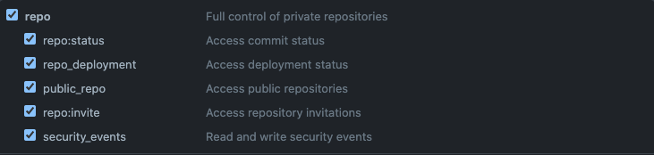

# terraform-module-versions

This is a helper script to get the latest version of The Orchard's terraform modules. It does this by checking github tags.

This is particularly useful when making updates to [terraform-infra](https://github.com/theorchard/terraform-infra) as it is best practice to update modules to their latest versions.

## Requirements
This script requires a `GITHUB_ACCESS_TOKEN`.

Follow this [guide](https://docs.github.com/en/authentication/keeping-your-account-and-data-secure/creating-a-personal-access-token) to create a token with **repo** access:



Copy the access token provided by github. This will need to be set as an environment variable along with a github username:

```bash
export GITHUB_USER='10x_engineer'
export GITHUB_ACCESS_TOKEN='new-public-access-token'
```

## Running The Script
Once the above requirements are met the script can be run:
```bash
./terraform_module_versions.sh
```

And it will return a list of terraform modules with their versions:
```bash
terraform-airflow,:
terraform-aws-waf:1.2.6
terraform-chef-bootstrap:1.1.0
terraform-datadog:3.0.11
terraform-dynamodb:2.2.0
terraform-efs:1.2.0
terraform-elasticache,:
terraform-elasticsearch:2.0.2
terraform-emr:1.2.0
terraform-fargate:2.1.2
terraform-github:2.0.1
terraform-jenkins:
terraform-kinesis:1.1.0
terraform-lambda:1.3.3
terraform-managed-kafka:2.1.0
terraform-owsrequest:1.0.0
terraform-rds:1.1.11
terraform-s3:2.5.1
terraform-secrets-manager:1.0.2
terraform-sentry:2.0.1
terraform-sftp:
terraform-sns:1.1.4
terraform-sqs:2.0.1
terraform-transit-gateway:
terraform-vmware:1.1.2
terraform-vpc:0.9.0
```

Wow. Such convenience.
